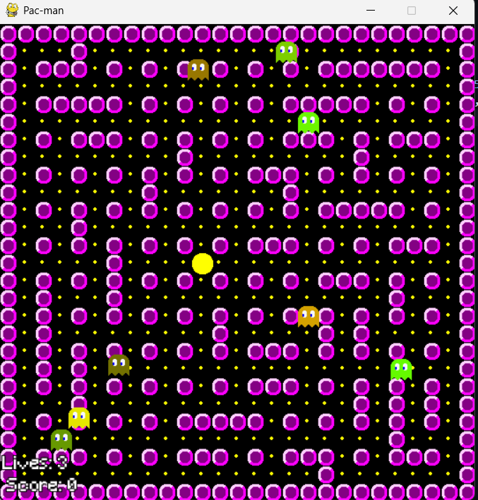

[](https://classroom.github.com/a/4ZAJL3PP)

# Laporan Akhir Final Project OOP D

## 1. Informasi Umum

- **Nama Game**: [Nama Game]
- **Anggota Kelompok**:
  1. [Rahmad Bisma Zulfi Pahlevi - 5025231290]
  2. [Muhammad Abdul Rafi - 5025231093]
  3. [Carmelo Yovan Gratito - 5025231173]
- **Tech Stack**: [Python, Pygame]

## 2. Deskripsi Game

referensi repo https://github.com/greyblue9/pacman-python

### 2.1 Konsep Game

- **Genre**: Arcade
- **Gameplay/Rule**: Explore the maze and avoid ghost
- **Objective**: Explore the maze and eat all the food
- **Single/Multi Player**: Single Player

### 2.2 Fitur Utama

1. Item Customization
2. 2 Player PvP
3. Controller Support(kalo bisa)
4. Character Cosmetics
5. Limited Character Customization
6. Character ability

## 3. Implementasi Fitur Wajib

### 3.1 Save/Load System

- **Implementasi**:
- **Konsep OOP**:
- **Penerapan SOLID**:
- **Design Pattern yang Digunakan**:
- **Code Snippet**:

```
[Code snippet here]
```

### 3.2 Achievement System

- **Jenis Achievement**:
  1. [Implementasi Achievement 1]
  2. [Implementasi Achievement 2]
- **Konsep OOP**:
- **Penerapan SOLID**:
- **Design Pattern yang Digunakan**:
- **Code Snippet**:

```
[Code snippet here]
```

## 4. Implementasi Fitur Lain

### 4.1 Fitur 1

- **Implementasi**: Multiple Type Of Ghost
- **Konsep OOP**: Parent Class Ghost berisi setiap Atribbut untuk menggerakan Ghost dan Child class sesuai type ghost untuk mengatur behavior ghost
- **Penerapan SOLID (Optional)**: LSP, OPEN/CLOSED
- **Design Pattern yang Digunakan (Optional)**:
- **Code Snippet**:

```
# Ghost
class Ghost_State(Enum):
    IDLE=auto()
    STRONG = auto()
    WEAK = auto()
    DEAD = auto()
    CHASE = auto()
    AMBUSH = auto()
    GUARD = auto()
    WANDER = auto()
    HUNT = auto()
    ESCAPE = auto()
    HOSTILE = auto()
    COOLDOWN = auto()

class Ghost:
    def __init__(self, screen):
        self.screen=screen
        self.cur_x = 0#TILES_X // 2
        self.cur_y = 0#TILES_Y // 2
        self.velx = 0
        self.vely = 0
        self.speed = 5

        self.path = []
        self.goal='0,0'
        self.reached_goal = True

        self.state="IDLE"
        self.last_path_update_time = time.time()
        self.last_state_time = time.time()

        self.maze = None
        self.maze_graph = None

        self.animFrame = 1
        self.animDelay = 0
        self.anim = {}

        self.Graph = None

        self.animFrame = 1
        self.animDelay = 0

        self.score = 400

    def set_graph(self, graph):
        self.Graph = graph

    def set_maze(self, maze, maze_graph):
        self.maze = maze
        self.maze_graph = maze_graph

    def get_pos(self):
        return (self.cur_x, self.cur_y)

    def set_pos(self):
        pos=random.choice([str(i) for i in self.maze_graph.keys()])
        self.cur_x,self.cur_y=[int(i)*TILE_SIZE for i in pos.split(',')]

    def set_state(self, state):
        self.state = state

    def get_state(self):
        return self.state

    def get_score(self):
        return self.score

    def dead(self):
        for i in range(1, 7, 1):
            self.anim[i] = get_image_surface(
            os.path.join(base_path, "../../resources", "sprite", "ghost " + str(i) + ".gif"))
            for y in range(0, 24, 1):
                for x in range(0, 24, 1):
                    if self.anim[i].get_at((x, y)) == (255, 0, 0, 255):
                        self.anim[i].set_at((x, y), (255, 255, 255, 255))
            self.anim[i] = pygame.transform.scale(self.anim[i], (0, 0))
        self.state = Ghost_State.DEAD


    def generate_path(self, goal_node):
        def heuristic(current_vertex, goal_vertex):
            c_x,c_y=self.Graph.decode_vertex_name(current_vertex)
            g_x,g_y=self.Graph.decode_vertex_name(goal_vertex)
            return (c_x-g_x)+(c_y-g_y)

        found=False
        start_node = self.Graph.encode_vertex_name(int(self.cur_x/TILE_SIZE), int(self.cur_y/TILE_SIZE))
        visited_vertex = set()
        vertex_pqueue = [(heuristic(start_node,goal_node), start_node)]
        current_vertex_cost = {start_node: 0}
        parent_map = {start_node: None}

        while vertex_pqueue and not found:
            _, current_vertex = heapq.heappop(vertex_pqueue)
            if current_vertex not in visited_vertex:
                visited_vertex.add(current_vertex)

                if current_vertex == goal_node:
                    found = True
                    break
                try:
                    for vertex, weight in self.maze_graph[current_vertex][2]:
                        tentative_neighbor_vertex_cost = current_vertex_cost[current_vertex] + weight
                        if vertex not in current_vertex_cost or tentative_neighbor_vertex_cost < current_vertex_cost[vertex]:
                            current_vertex_cost[vertex] = tentative_neighbor_vertex_cost
                            estimated_goal_cost = tentative_neighbor_vertex_cost + heuristic(vertex,goal_node)
                            heapq.heappush(vertex_pqueue, (estimated_goal_cost, vertex))
                            parent_map[vertex] = current_vertex
                except KeyError as e:
                    print('KeyError:', e, "May because of the wall")
                    continue
        if found:
            path = []
            step = goal_node
            while step is not None:
                path.append(step)
                step = parent_map[step]
            path.reverse()
            self.path=path
            self.goal=self.Graph.encode_vertex_name(self.cur_x//TILE_SIZE, self.cur_y//TILE_SIZE)
            # print(self.path)
            return self.path

    def draw(self, offset_x=0, offset_y=0):
        self.screen.blit(self.anim[self.animFrame], (self.cur_x+offset_x, self.cur_y+offset_y))
        self.animDelay += 1
        if self.animDelay >= 3:
            self.animFrame += 1
            if self.animFrame > 6:
                self.animFrame = 1
            self.animDelay = 0

    def move(self):
        self.cur_x += self.velx
        self.cur_y += self.vely
        if self.Graph.decode_vertex_name(self.goal)[0] < int(self.cur_x/TILE_SIZE):
            self.velx = -self.speed
            self.vely = 0
        if self.Graph.decode_vertex_name(self.goal)[0] > int(self.cur_x/TILE_SIZE):
            self.velx = self.speed
            self.vely = 0
        if self.Graph.decode_vertex_name(self.goal)[1] < int(self.cur_y/TILE_SIZE):
            self.vely = -self.speed
            self.velx = 0
        if self.Graph.decode_vertex_name(self.goal)[1] > int(self.cur_y/TILE_SIZE):
            self.vely = self.speed
            self.velx = 0

        # print(int(self.cur_x/TILE_SIZE), int(self.cur_y/TILE_SIZE))
        if (self.path and (self.Graph.encode_vertex_name(int(self.cur_x/TILE_SIZE), int(self.cur_y/TILE_SIZE)) == self.goal)):
            if len(self.path)>4:
                self.path.pop(0)
                self.path.pop(0)
                # self.path.pop(0)
                # self.path.pop(0)
            self.goal = self.path.pop(0)

        elif not self.path:
            self.velx = 0
            self.vely = 0
            self.reached_goal = True

    def control(self, current_time=0,player=None):
        # if current_time - self.last_path_update_time > 1:
        #     self.last_path_update_time = current_time
        #     self.generate_path(self.Graph.encode_vertex_name(random.randint(0,29),random.randint(0,29)))
        # self.draw()
        # self.move()
        pass


class Dumb_Ghost(Ghost):
    # random wandering
    def __init__(self, screen):
        super().__init__(screen)
        self.type="DUMB"
        self.color=(random.randint(100, 255), random.randint(100, 255), 0, random.randint(100, 255))

        for i in range(1, 7, 1):
            self.anim[i] = get_image_surface(
                os.path.join(base_path, "../../resources", "sprite", "ghost " + str(i) + ".gif"))

            for y in range(0, 24, 1):
                for x in range(0, 24, 1):
                    if self.anim[i].get_at((x, y)) == (255, 0, 0, 255):
                        self.anim[i].set_at((x, y), self.color)

    def control(self, current_time=0):
        if current_time - self.last_path_update_time > random.randint(1,9):
            self.last_path_update_time = current_time
            self.generate_path(random.choice([str(i) for i in self.maze_graph.keys()]))#self.Graph.encode_vertex_name(random.randint(0,29),random.randint(0,29))

        # print(self.path)
        self.move()
        self.draw()

class Wanderer_Ghost(Ghost):
    # random wandering will chase if player seen(by in the same row or column)
    # 5 second chase or timeout
    def __init__(self, screen):
        super().__init__(screen)
        self.type="WANDERER"
        self.color=(0, 255, 0, 255)

        for i in range(1, 7, 1):
            self.anim[i] = get_image_surface(
                os.path.join(base_path, "../../resources", "sprite", "ghost " + str(i) + ".gif"))

            for y in range(0, 24, 1):
                for x in range(0, 24, 1):
                    if self.anim[i].get_at((x, y)) == (255, 0, 0, 255):
                        self.anim[i].set_at((x, y), self.color)

    def control(self, current_time=0,player=None):
        if current_time - self.last_path_update_time > random.randint(1,5):
            self.last_path_update_time = current_time
            self.generate_path(self.Graph.encode_vertex_name(random.randint(0,29),random.randint(0,29)))
        self.draw()
        self.move()

class Hunter2_Ghost(Ghost):
    # bfs for game ballance (depend)
    # hunt and ambush the player by going to the player's predicted position
    # 10second chase 4second cooldown
    # go
    def __init__(self, screen):
        super().__init__(screen)
        self.type="HUNTER2"
        self.color=(0, 0, 255, 255)

        for i in range(1, 7, 1):
            self.anim[i] = get_image_surface(
                os.path.join(base_path, "../../resources", "sprite", "ghost " + str(i) + ".gif"))

            for y in range(0, 24, 1):
                for x in range(0, 24, 1):
                    if self.anim[i].get_at((x, y)) == (255, 0, 0, 255):
                        self.anim[i].set_at((x, y), self.color)

    def sense_the_player(self, player_pos):
        c_x,c_y=self.cur_x//TILE_SIZE,self.cur_y//TILE_SIZE
        g_x,g_y=player_pos[0]//TILE_SIZE, player_pos[1]//TILE_SIZE#self.Graph.decode_vertex_name(player_pos)
        return (c_x-g_x)+(c_y-g_y)

    def ambush(self, player_direction, player_x, player_y):
        if player_direction == "LEFT":
            for i in range(5):
                if self.maze_graph[player_x-1][player_y] != "#":
                    player_x -= 1
                elif self.maze_graph[player_x][player_y-1] != "#":
                    player_y -= 1
                elif self.maze_graph[player_x][player_y+1] != "#":
                    player_y += 1
                elif self.maze_graph[player_x+1][player_y] != "#":
                    player_x += 1
        elif player_direction == "RIGHT":
            for i in range(5):
                if self.maze_graph[player_x+1][player_y] != "#":
                    player_x += 1
                elif self.maze_graph[player_x][player_y-1] != "#":
                    player_y -= 1
                elif self.maze_graph[player_x][player_y+1] != "#":
                    player_y += 1
                elif self.maze_graph[player_x-1][player_y] != "#":
                    player_x -= 1
        elif player_direction == "UP":
            for i in range(5):
                if self.maze_graph[player_x][player_y-1] != "#":
                    player_y -= 1
                elif self.maze_graph[player_x+1][player_y] != "#":
                    player_x += 1
                elif self.maze_graph[player_x-1][player_y] != "#":
                    player_x -= 1
                elif self.maze_graph[player_x][player_y+1] != "#":
                    player_y += 1
        elif player_direction == "DOWN":
            for i in range(5):
                if self.maze_graph[player_x][player_y+1] != "#":
                    player_y += 1
                elif self.maze_graph[player_x+1][player_y] != "#":
                    player_x += 1
                elif self.maze_graph[player_x-1][player_y] != "#":
                    player_x -= 1
                elif self.maze_graph[player_x][player_y-1] != "#":
                    player_y -= 1
        return self.Graph.encode_vertex_name(player_x, player_y)

    def control(self, current_time=0,player=None):
        if self.feel_the_player(player.get_pos()) > 7:
            self.state = Ghost_State.AMBUSH
        else:
            if self.state == Ghost_State.HUNT:
                if current_time - self.last_state_time < random.randint(7, 10):
                    if current_time - self.last_path_update_time > 2:
                        self.last_path_update_time = current_time
                        player_pos = player.get_pos()
                        self.generate_path(self.Graph.encode_vertex_name(player_pos[0] // TILE_SIZE, player_pos[1] // TILE_SIZE))
                else:
                    self.state = Ghost_State.COOLDOWN
                    self.last_state_time = current_time
            elif self.state == Ghost_State.COOLDOWN:
                if current_time - self.last_state_time < 3:
                    if current_time - self.last_path_update_time > 2:
                        self.last_path_update_time = current_time
                        self.generate_path(self.Graph.encode_vertex_name(random.randint(0, 29), random.randint(0, 29)))
                else:
                    self.state = Ghost_State.HUNT
                    self.last_state_time = current_time


        if self.state == Ghost_State.AMBUSH:
            if current_time - self.last_path_update_time > random.randint(1,5):
                self.last_path_update_time = current_time
                player_direction = player.get_direction()
                player_x, player_y = player.get_pos()
                self.generate_path(self.Graph.encode_vertex_name(self.ambush(player_direction, player_x, player_y)))
        elif self.state == Ghost_State.HUNT:
            if current_time - self.last_path_update_time > 1:
                self.last_path_update_time = current_time
                self.generate_path(self.Graph.encode_vertex_name(random.randint(0,29),random.randint(0,29)))


        self.draw()
        self.move()

class Hunter1_Ghost(Ghost):
    # bfs for game ballance (depend)
    # hunt the player
    # 7second chase or 2second cooldown
    def __init__(self, screen):
        super().__init__(screen)
        self.type="HUNTER1"
        self.state = Ghost_State.HUNT
        self.color=(50, 50, 50)

        for i in range(1, 7, 1):
            self.anim[i] = get_image_surface(
                os.path.join(base_path, "../../resources", "sprite", "ghost " + str(i) + ".gif"))

            for y in range(0, 24, 1):
                for x in range(0, 24, 1):
                    if self.anim[i].get_at((x, y)) == (255, 0, 0, 255):
                        self.anim[i].set_at((x, y), self.color)

    def control(self, current_time=0,player=None, offset_x=0, offset_y=0):
        if self.state == Ghost_State.HUNT:
            if current_time - self.last_state_time < random.randint(7, 10):
                if current_time - self.last_path_update_time > 1:
                    self.last_path_update_time = current_time
                    player_pos = player.get_pos()
                    self.generate_path(self.Graph.encode_vertex_name(player_pos[0] // TILE_SIZE, player_pos[1] // TILE_SIZE))
            else:
                self.state = Ghost_State.COOLDOWN
                self.last_state_time = current_time
        elif self.state == Ghost_State.COOLDOWN:
            if current_time - self.last_state_time < 2:
                if current_time - self.last_path_update_time > 4:
                    self.last_path_update_time = current_time
                    self.generate_path(self.Graph.encode_vertex_name(random.randint(0, 29), random.randint(0, 29)))
            else:
                self.state = Ghost_State.HUNT
                self.last_state_time = current_time

        self.draw(offset_x, offset_y)
        self.move()

```

### 4.2 Fitur 2

- **Implementasi**: Maze Generator
- **Konsep OOP**: Sebuah 2 Class independent Maze_Generator dan Graph dengan fungsi masing masing dan dengan Class Level yang dependen pada kedua class tersebut untuk meng generate Maze untuk permainan
- **Penerapan SOLID (Optional)**: INTERFACE SEGREGATION, SINGLE RESPONSIBILITY
- **Design Pattern yang Digunakan (Optional)**:
- **Code Snippet**:

```
from enum import Enum, auto
import random
# from Game_Controller import *

class Difficulty(Enum):
    EASY = auto()
    MEDIUM = auto()
    HARD = auto()
    SUPER_HARD = auto()
    pass

class Objectify:
    def __init__(self):
        pass

    def populate_maze(self, maze, object_list):
        for y in range(len(maze)):
            for x in range(len(maze[y])):
                if maze[y][x] == ' ':
                    maze[y][x] = object_list.pop(0)
        return maze

class Graph:
    def __init__(self):
        pass


    def encode_vertex_name(self, x,y):
      return str(x)+','+str(y)

    def decode_vertex_name(self, str):
      return [int(i) for i in str.split(',')]

    def add_vertex(self, symbol, vertex, heuristic_value=0, adjacentcy_list={}):
        if vertex not in adjacentcy_list:
            adjacentcy_list[vertex] = [symbol, heuristic_value,[]]
        return adjacentcy_list

    def add_edge(self, symbol_src, node_src, symbol_dest, node_dest, weight=0,adjacentcy_list={}):
        if node_src not in adjacentcy_list:
            adjacentcy_list=self.add_vertex(symbol_src, node_src)
        if node_dest not in adjacentcy_list:
            adjacentcy_list=self.add_vertex(symbol_dest, node_dest)

        if node_src in adjacentcy_list and node_dest in adjacentcy_list:
            adjacentcy_list[node_src][2].append((node_dest, weight))
            adjacentcy_list[node_dest][2].append((node_src, weight))
        return adjacentcy_list

    def connect_maze(self, grid_map): #traverse the grid with bfs to connect each node as adjacent vertex to form an edge, not necessary but it looks cool
        # Traditional traverse
        # for i in range(len(self.__grid_map)):
        #   for j in range(len(self.__grid_map[i])):
        #     pass
        walkable_path={}
        # self.__wall_list={}
        grid_width = len(grid_map[0])
        grid_height=len(grid_map)

        # begin_x, begin_y=random.randint(0,grid_height-1),random.randint(0,grid_width-1)
        begin_x, begin_y=0,0
        if grid_map[begin_x][begin_y]=="#":
            while(grid_map[begin_x][begin_y]=="#"):
                begin_x, begin_y=random.randint(0,grid_height-1),random.randint(0,grid_width-1)
        x,y=begin_x,begin_y
        vertex_queue=[self.encode_vertex_name(x,y)]
        visited_vertex=set()
        while(vertex_queue):
            current_vertex=vertex_queue.pop(0)
            visited_vertex.add(current_vertex)

            cur_x,cur_y=self.decode_vertex_name(current_vertex)
            # check adjacent vertex by coordinates
            if (cur_x-1<grid_height and cur_x-1>=0) and (grid_map[cur_x-1][cur_y] != "#"):
                neighbor=self.encode_vertex_name(cur_x-1,cur_y)
                if(neighbor not in visited_vertex or (neighbor,1) not in walkable_path[current_vertex][2]):
                    vertex_queue.append(neighbor)
                    visited_vertex.add(neighbor)
                    walkable_path=self.add_edge(grid_map[cur_x][cur_y],current_vertex,grid_map[cur_x-1][cur_y],neighbor,1, walkable_path)

            if (cur_x+1<grid_height and cur_x+1>=0) and (grid_map[cur_x+1][cur_y] != "#"):
                neighbor=self.encode_vertex_name(cur_x+1,cur_y)
                if(neighbor not in visited_vertex or (neighbor,1) not in walkable_path[current_vertex][2]):
                    vertex_queue.append(neighbor)
                    visited_vertex.add(neighbor)
                    walkable_path=self.add_edge(grid_map[cur_x][cur_y],current_vertex,grid_map[cur_x-1][cur_y],neighbor,1,walkable_path)

            if (cur_y-1<grid_width and cur_y-1>=0) and (grid_map[cur_x][cur_y-1] != "#"):
                neighbor=self.encode_vertex_name(cur_x,cur_y-1)
                if(neighbor not in visited_vertex or (neighbor,1) not in walkable_path[current_vertex][2]):
                    vertex_queue.append(neighbor)
                    visited_vertex.add(neighbor)
                    walkable_path=self.add_edge(grid_map[cur_x][cur_y],current_vertex,grid_map[cur_x-1][cur_y],neighbor,1,walkable_path)

            if (cur_y+1<grid_width and cur_y+1>=0) and (grid_map[cur_x][cur_y+1] != "#"):
                neighbor=self.encode_vertex_name(cur_x,cur_y+1)
                if(neighbor not in visited_vertex or (neighbor,1) not in walkable_path[current_vertex][2]):
                    vertex_queue.append(neighbor)
                    visited_vertex.add(neighbor)
                    walkable_path=self.add_edge(grid_map[cur_x][cur_y],current_vertex,grid_map[cur_x-1][cur_y],neighbor,1,walkable_path)

        return walkable_path

class Maze_Generator:
    def __init__(self):
        self.width = 21
        self.height = 21
        self.grid = [['#' for _ in range(self.width)] for _ in range(self.height)] # base maze
        self.visited = set()

    def generate_maze(self):
        """Generate the maze using Prim's algorithm."""
        self.grid = [['#' for _ in range(self.width)] for _ in range(self.height)]
        # Start with an initial random cell
        start_x, start_y = 1, 1
        self.grid[start_y][start_x] = ' '
        self.visited.add((start_x, start_y))

        # Initialize the frontier with adjacent cells
        frontier = self.get_frontier_cells(start_x, start_y)

        while frontier:
            # Randomly pick a frontier cell
            current_x, current_y = random.choice(frontier)
            frontier.remove((current_x, current_y))

            # carve
            adjacent_visited = self.get_adjacent_visited(current_x, current_y)
            if adjacent_visited:
                # Carve a path to the adjacent visited cell
                px, py = random.choice(adjacent_visited)
                self.grid[current_y][current_x] = ' '
                self.grid[(py + current_y) // 2][(px + current_x) // 2] = ' '
                self.visited.add((current_x, current_y))

                # Add new frontier cells
                frontier.extend(self.get_frontier_cells(current_x, current_y))
        return self.grid

    def get_frontier_cells(self, x, y):
        """Get frontier cells that are adjacent to the visited cells."""
        directions = [(2, 0), (-2, 0), (0, 2), (0, -2)]
        frontier_cells = []

        for dx, dy in directions:
            nx, ny = x + dx, y + dy
            if (0 < nx < self.width and 0 < ny < self.height and
                (nx, ny) not in self.visited and (nx, ny) not in frontier_cells):

                # The frontier cell must be a wall inside the grid
                if self.grid[ny][nx] == '#':
                    frontier_cells.append((nx, ny))

        return frontier_cells

    def get_adjacent_visited(self, x, y):
        """Get adjacent visited cells to the current cell."""
        directions = [(2, 0), (-2, 0), (0, 2), (0, -2)] # right, left, down, up
        adjacent_cells = []

        for dx, dy in directions:
            nx, ny = x + dx, y + dy
            if (0 <= nx < self.width and 0 <= ny < self.height and
                (nx, ny) in self.visited):
                adjacent_cells.append((nx, ny))

        return adjacent_cells

    def display(self):
        """Display the maze."""
        for row in self.grid:
            print(''.join(row))

    def get_maze(self):
        return self.grid

class Level:
    def __init__(self, level_number=0, level_x_size=27, level_y_size=27):
        self.level_number = level_number
        self.level_graph = None
        self.level_path_list = None
        self.level_maze = None
        self.level_info = None

        self.level_x_size = level_x_size
        self.level_y_size = level_y_size
        self.ghost_lineup = []
        self.difficulty = random.choice(list(Difficulty))
        self.EASY_DIFF=["DUMB", "DUMB", "WANDERER", "HUNTER1"] # Ghost arrangement
        self.MEDIUM_DIFF=["DUMB", "WANDERER", "HUNTER1", "HUNTER1"]
        self.HARD_DIFF=["DUMB", "WANDERER", "HUNTER1", "HUNTER1", "HUNTER2"]
        self.SUPERHARD_DIFF=["WANDERER", "HUNTER1","HUNTER1", "HUNTER2","HUNTER2"]


    # def set_level(self, level_number):
    #     # self.level_number = level_number
    #     # self.level_map = Map()
    #     # self.level_graph = Graph()
    #     pass

    def load_level(self):
        # self.set_level(level_number)
        pass

    def advance_level(self):
        self.level_number += 1
        self.difficulty = random.choice(list(Difficulty))
        if self.difficulty == Difficulty.EASY:
            self.ghost_lineup = [random.choice(self.EASY_DIFF) for _ in range(4)]
        elif self.difficulty == Difficulty.MEDIUM:
            self.ghost_lineup = [random.choice(self.MEDIUM_DIFF) for _ in range(5)]
        elif self.difficulty == Difficulty.HARD:
            self.ghost_lineup = [random.choice(self.HARD_DIFF) for _ in range(6)]
        elif self.difficulty == Difficulty.SUPER_HARD:
            self.ghost_lineup = [random.choice(self.SUPERHARD_DIFF) for _ in range(8)]
        self.generate_maze(maze_width=self.level_x_size, maze_height=self.level_y_size)
        # self.set_level(self.level_number)
        print("Difficulty: ", self.difficulty)

    def get_current_level_data(self):
        return {
            'level':self.level_number,
            'difficulty':self.difficulty,
            'size':(self.level_x_size,self.level_y_size),
            'ghosts':self.ghost_lineup,
            'maze':self.level_maze,
            'graph':self.level_graph,
            'path':self.level_path_list
            }


    def generate_maze(self,maze_width=25,maze_height=25, grapher=Graph(), maze=Maze_Generator()):
        maze.width = self.level_x_size = maze_width
        maze.height = self.level_y_size = maze_height
        # maze.generate_maze()
        # maze.display()
        # maze.width = self.level_x_size = maze_width
        # maze.height = self.level_y_size = maze_height
        # maze.generate_maze()
        self.level_maze = maze.generate_maze()
        # maze.display()
        self.level_graph = grapher.connect_maze(self.level_maze)
        self.level_path_list = [str(i) for i in self.level_graph.keys()]
        return self.level_graph, self.level_maze

if __name__ == "__main__":
    # maze = Maze_Generator()
    # maze.generate_maze()
    # maze.display()
    level=Level()
    # # level.advance_level()
    level.generate_maze(maze_width=15,maze_height=15)
    # print(level.get_current_level_data())
    pass

```

## 5. Screenshot dan Demo

- : [Didalam Game]
- **Screenshot 2**: [Deskripsi]
- **Link Demo Video**: [URL]

## 6. Panduan Instalasi dan Menjalankan Game

1. Installasi Python.
2.
3.

## 7. Kendala dan Solusi

1. **Kendala 1**: Keterbatasan skill dan waktu untuk ide awal yang merupakan game 2d shooter berdasarkan game ROUNDS
   - Solusi: berganti tema ke game arcade
2. **Kendala 2**: Posisi player yang overlap dengan tembok
   - Solusi: Belum ada
3. **Kendala 3**: Arsitektur kode yang kurang baik
   - Solusi: Belum ada
4. **Kendala 4**: Permasalaahan Tampilan layar yang sulit(implementasi smart screen movement)
   - Solusi: Belum ada
5. **Kendala 4**: Pembuatan User Interface di Pygame tidak mudah
   - Solusi: Belum Selesai
6. **Kendala 4**: Pembuatan Kode untuk behavior ghost yang sulit
   - Solusi: Mengurangi tipe ghost yang akan diimplementasikan

## 8. Kesimpulan dan Pembelajaran

- **Kesimpulan**:Untuk project yang kompleks memerlukan perencanaan matang, untuk mengurangi kemungkinan kesalahan arsitektur kode. tetapi untuk projek yang lebih kecil mungkin penggunaan oop hanya akan memperlambat proses pengembangan dengan dependensi setiap class yang mungkin agak sulit untuk diikuti, tetap terdapat kelebihan dan kekurangan masing-masing.
- **Pembelajaran**: Prinsip pengembangan Objek oriented, prinsip SOLIDS
